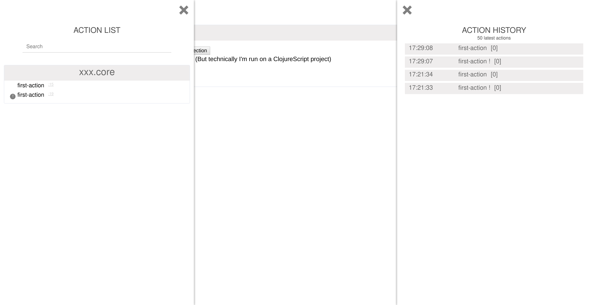

# Reaction

## Description
Reaction is a library to manage and dispatch actions.

It is based around the Atom principle of ClojureScript.

Please add `[reaction "0.1.0"]` to your `project.clj` to use it.

It provides a visual interface to display the actions list/history.



## Usage
### Create actions: `defaction`
An **action** is a modification that will be apply to an atom (The same way you'd do it around a **swap!**)

```clojure
(ns whatever.core
  (:require [reaction :refer-macros [defaction]]))

(defaction test-action
  "Increments the counter of 1"
  [m]
  (update m :counter inc))
```

### Create actions!: `defaction!`
An **action!** is a function used to **dispatch** actions(!) in an asynchronous way.

```clojure
(ns whatever.core
  (:require [reaction :refer-macros [defaction defaction! dispatch!]]))

(defaction test-action
  "Increments the counter of 1"
  [m]
  (update m :counter inc))

(defaction! test-action
  "Dispatches [:test-action] after 1s"
  [state]
  (.setTimeout js/window
               #(dispatch state [:test-acion])
               1000))
```

### Recur on an action/action!: `reaction`
You can use `reaction` to recur on the action/action!

(*Note*: no need to refer `reaction`)
```clojure
(ns whatever.core
  (:require [reaction :refer-macros [defaction]]))

(defaction increment
  ([m]
   (reaction m 1))
  ([m i]
   (update m :counter #(% + i))))
```

### Dispatch actions(!): `dispatch!`
**dispatch!** is a macro used to **dispatch** one or multiple actions(!)

```clojure
(ns whatever.core
  (:require [reaction :refer-macros [defaction defaction! dispatch!]]))

(dispatch state
          [:test-action]
          :test-action
          [:increment 1]
          [! :test-action])
```

### Bind graphical sidecars: `bind-actions-list`
**bind-actions-list** can be called to mount the action-list/history.

```clojure
(ns whatever.core
  (:require [reaction :refer [bind-actions-list]]))

(bind-actions-list)
```
